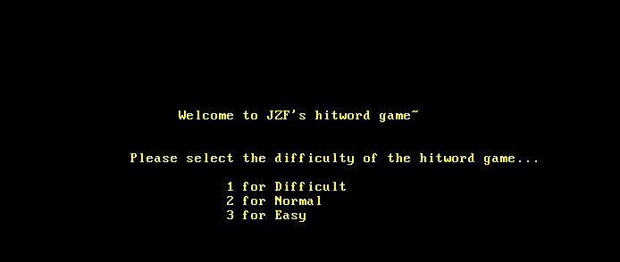
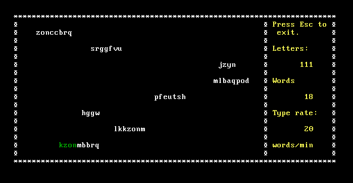
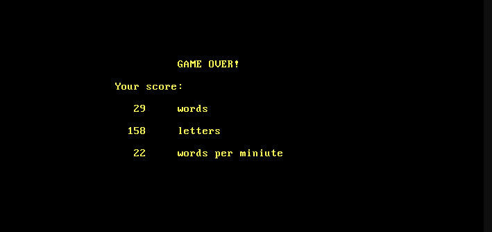

# L-AND-T_mini-project

<!-- TABLE OF CONTENTS -->

  
Table of Contents

  <ol>
    <li>
      <a href="#about-the-project">About The Project</a>
      <ul>
        <li><a href="#built-with">Built With</a></li>
      </ul>
    </li>
    <li> 
      <a href="#How to play">How to play</a>
    </li>
    <li> 
      <a href="#Images">Images</a>
    </li> 
      
  
     

<!-- ABOUT THE PROJECT -->
## About The Project

 
TypingGame, as its name reveals, is a game designed to improve one's typing skills, with randomly-generated words to be exactly typed. When playing, one will accompanied by the melody from Croatian Rhapsody. As a homework assigned in the C program design course for freshman majoring in CS, it is an individual project for non-comercial purposes. This system allows you to enjoy the funny typing game, as well as to improve your typing speed and correct ratio.

### Built With

This section should list any major frameworks that you built your project using. 
* [C Language](https://www.geeksforgeeks.org/c-language-set-1-introduction/)
* [VS Code](https://code.visualstudio.com/)

<!-- How to play-->

## How to play
1.Select one of the difficulty level you want.
1.After selecting the level the game gets started and in the screen there is shower of randomly arranged alphabets words, the user have to type down the words before it goes off the screen.
1.Whenever a word touch the ground, game is over. And your score will be displayed at the end. (images available below)
   

<!-- Images -->
## Images
  
  
 

